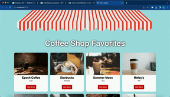

# Web Development Project 1 - Community Board: Coffee Shops

Submitted by: Carlos Ortiz

This web app: Lists a few of the most popular local spots in Austin and DFW, as well as famous coffee shops worldwide

Time spent: 10 hours spent in total

## Required Features

The following **required** functionality is completed:

- [x] **There is a unique theme for events or resources relevant to a specific community**
- [x] **At least 10 unique resources or events are displayed in a responsive card format**

The following **optional** features are implemented:

- [x] Buttons or links to a related resources are on each card component
- [x] The site is responsive for both desktop and mobile formats

The following **additional** features are implemented:

- [ ] List anything else that you added to improve the site's functionality!

## Video Walkthrough

## Notes

The biggest challenge I encountered was organizing everything (CSS) and making sure it all was positioned as close as possible to the example.

## License

    Copyright 2023 Carlos Ortiz

    Licensed under the Apache License, Version 2.0 (the "License");
    you may not use this file except in compliance with the License.
    You may obtain a copy of the License at

        http://www.apache.org/licenses/LICENSE-2.0

    Unless required by applicable law or agreed to in writing, software
    distributed under the License is distributed on an "AS IS" BASIS,
    WITHOUT WARRANTIES OR CONDITIONS OF ANY KIND, either express or implied.
    See the License for the specific language governing permissions and
    limitations under the License.
